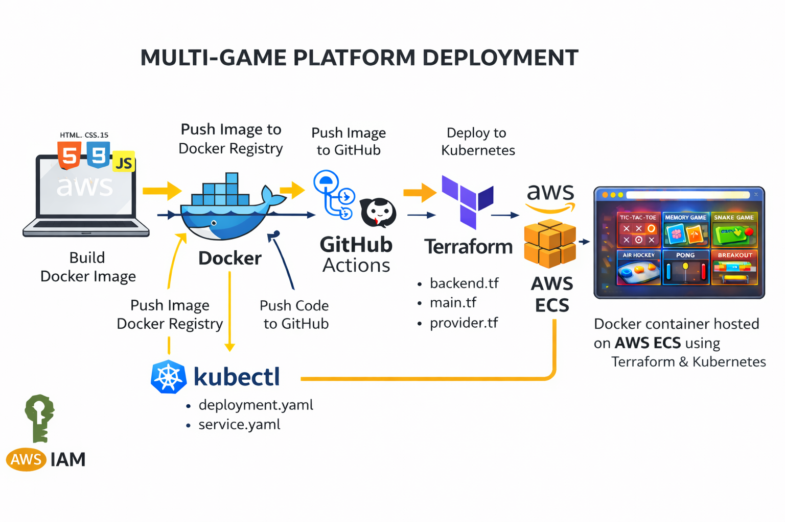

# 🎮 Multi-Game Platform - DevOps Deployment Pipeline



A modern, interactive web-based gaming platform featuring 6 classic games with complete DevOps CI/CD pipeline, containerization, and cloud deployment capabilities.

## 🛠️ DevOps Tools & Technologies Stack


## 🎮 Available Games

This platform includes 6 fully functional classic games:

1. **⭕ Tic-Tac-Toe** - Classic 3x3 grid strategy game
   - Single Player (vs AI)
   - Two Player mode
   
2. **🧠 Memory Game** - Match the pairs card game
   - Single Player (vs AI)
   - Two Player mode
   
3. **🐍 Snake Game** - Classic snake eating game
   - Solo play with high score tracking
   - Arrow key controls with pause feature
   
4. **🏒 Air Hockey** - Fast-paced hockey simulation
   - Single Player (vs AI)
   - Two Player mode
   - Mouse-controlled paddles
   
5. **🏓 Pong Game** - Classic paddle ball game
   - Single Player (vs AI)
   - Two Player mode
   - First to 10 points wins
   
6. **🧱 Breakout** - Brick breaking arcade game
   - Solo play with multiple levels
   - Lives and score tracking
   - Progressive difficulty

## 📋 Project Overview

This project demonstrates a complete DevOps workflow from development to production deployment. It showcases:

- Modern web development with vanilla JavaScript
- Containerization with Docker
- Container orchestration with Kubernetes
- Infrastructure as Code (IaC) with Terraform
- CI/CD automation with GitHub Actions
- Cloud deployment on AWS ECS Fargate
- Production-grade Nginx configuration
- Multi-environment deployment strategies

## 🏗️ Architecture

```
┌─────────────────────────────────────────────────────────────┐
│                    GitHub Repository                         │
│                  (Source Code + CI/CD)                       │
└────────────────────┬────────────────────────────────────────┘
                     │
                     ▼
┌─────────────────────────────────────────────────────────────┐
│                  GitHub Actions CI/CD                        │
│  ┌──────────────┐      ┌──────────────┐                    │
│  │ Build Image  │ ───▶ │ Push to Hub  │                    │
│  └──────────────┘      └──────────────┘                    │
└────────────────────┬────────────────────────────────────────┘
                     │
                     ▼
┌─────────────────────────────────────────────────────────────┐
│                     Docker Hub                               │
│            (Container Image Registry)                        │
└────────┬────────────────────────────────┬───────────────────┘
         │                                │
         ▼                                ▼
┌──────────────────────┐      ┌──────────────────────────────┐
│   Kubernetes (K8s)   │      │      AWS ECS Fargate         │
│  ┌────────────────┐  │      │  ┌────────────────────────┐  │
│  │  Deployment    │  │      │  │   ECS Cluster          │  │
│  │  (3 Replicas)  │  │      │  │   - Task Definition    │  │
│  └────────────────┘  │      │  │   - Service            │  │
│  ┌────────────────┐  │      │  │   - Fargate Launch     │  │
│  │ LoadBalancer   │  │      │  └────────────────────────┘  │
│  │   Service      │  │      │  ┌────────────────────────┐  │
│  └────────────────┘  │      │  │   Networking           │  │
│  ┌────────────────┐  │      │  │   - VPC                │  │
│  │ Health Checks  │  │      │  │   - Security Groups    │  │
│  │ - Liveness     │  │      │  │   - Public IP          │  │
│  │ - Readiness    │  │      │  └────────────────────────┘  │
│  └────────────────┘  │      └──────────────────────────────┘
└──────────────────────┘
         │                                │
         └────────────┬───────────────────┘
                      ▼
              ┌──────────────┐
              │   End Users  │
              └──────────────┘
```

## 📁 Project Structure

```
Multiple-games-deploy/
├── .github/
│   └── workflows/
│       └── deploy.yml              # GitHub Actions CI/CD pipeline
├── Kubernetes/
│   └── deployment.yaml             # K8s deployment & service manifests
├── terraform/
│   ├── backend.tf                  # S3 backend for state management
│   ├── main.tf                     # ECS cluster, task, service definitions
│   ├── provider.tf                 # AWS provider configuration
│   ├── values.tf                   # VPC, subnets, security groups
│   └── get_ip.sh                   # Script to fetch ECS task public IP
├── terraform-production/
│   └── main.tf                     # Production environment config
├── index.html                      # Main game platform HTML
├── styles.css                      # Game styling and animations
├── script.js                       # Game logic and interactions
├── Dockerfile                      # Container image definition
├── docker-compose.yml              # Local development setup
├── nginx.conf                      # Nginx web server configuration
├── get_ip.sh                       # Helper script for IP retrieval
├── package.json                    # Project metadata
└── project.png                     # Project architecture diagram
```

## 🚀 Deployment Options

### Option 1: Local Development (Simple)

Open directly in browser:
```bash
# Navigate to project directory
cd Multiple-games-deploy

# Open index.html in your browser


# Access at: http://localhost:8000
```

### Option 2: Docker (Recommended for Testing)

```bash
# Build the Docker image
docker build -t multi-game-platform .

# Run the container
docker run -d -p 3000:80 --name games multi-game-platform

# Access at: http://localhost:3000

# Stop and remove
docker stop games && docker rm games
```

### Option 3: Docker Compose (Best for Local Development)

```bash
# Start the application
docker-compose up -d

# View logs
docker-compose logs -f

# Access at: http://localhost:3000

# Stop the application
docker-compose down
```

### Option 4: Kubernetes (Production-Ready)

```bash
# Prerequisites: kubectl configured with cluster access

# Create namespace
kubectl create namespace games

# Deploy the application
kubectl apply -f Kubernetes/deployment.yaml

# Check deployment status
kubectl get deployments -n games
kubectl get pods -n games
kubectl get services -n games

# Get LoadBalancer IP/URL
kubectl get service multi-game-platform-service -n games

# Scale deployment
kubectl scale deployment multi-game-platform -n games --replicas=5

# View logs
kubectl logs -f deployment/multi-game-platform -n games

# Delete deployment
kubectl delete -f Kubernetes/deployment.yaml
```

### Option 5: AWS ECS with Terraform (Cloud Production)

```bash
# Prerequisites: AWS CLI configured, Terraform installed

# Navigate to terraform directory
cd terraform

# Initialize Terraform
terraform init

# Preview changes
terraform plan

# Deploy infrastructure
terraform apply -auto-approve

# Get the public IP of running task
chmod +x get_ip.sh
./get_ip.sh

# Access at: http://<PUBLIC_IP>:80

# Destroy infrastructure
terraform destroy -auto-approve
```

## 🔄 CI/CD Pipeline (GitHub Actions)

The automated pipeline includes:

### Build & Push Job
1. **Checkout Code** - Clone repository
2. **Setup Docker Buildx** - Multi-platform build support
3. **Login to Docker Hub** - Authenticate with registry
4. **Build & Push Image** - Create and push container image
   - Tags: `latest` and `<commit-sha>`
   - Layer caching enabled for faster builds

### Deploy to Kubernetes Job
1. **Configure AWS Credentials** - Setup AWS access
2. **Setup kubectl** - Install Kubernetes CLI
3. **Configure kubeconfig** - Setup cluster access
4. **Create Namespace** - Ensure namespace exists
5. **Deploy Application** - Apply Kubernetes manifests
6. **Rollout Status** - Wait for successful deployment

### Required GitHub Secrets
```yaml
DOCKERHUB_USERNAME      # Docker Hub username
DOCKERHUB_TOKEN         # Docker Hub access token
AWS_ACCESS_KEY_ID       # AWS access key
AWS_SECRET_ACCESS_KEY   # AWS secret key
KUBE_CONFIG             # Base64 encoded kubeconfig file
```

## 🛠️ Technology Stack Details

### Frontend Technologies
- **HTML5** - Semantic markup and Canvas API for games
- **CSS3** - Modern styling, animations, and responsive design
- **JavaScript (ES6+)** - Game logic, DOM manipulation, event handling

### Web Server
- **Nginx (Alpine)** - Lightweight, high-performance web server
  - Gzip compression enabled
  - Static asset caching (1 year)
  - SPA routing support
  - Optimized configuration

### Containerization
- **Docker** - Container runtime and image building
- **Docker Compose** - Multi-container orchestration
- **Docker Hub** - Container image registry
- **Alpine Linux** - Minimal base image (5MB)

### Container Orchestration
- **Kubernetes** - Production-grade orchestration
  - 3 replica deployment for high availability
  - LoadBalancer service for external access
  - Health checks (liveness & readiness probes)
  - Resource limits and requests
  - Rolling updates with zero downtime

### Infrastructure as Code
- **Terraform** - Infrastructure provisioning
  - AWS ECS Cluster creation
  - Fargate task definitions
  - VPC and networking setup
  - Security group configuration
  - IAM roles and policies
  - S3 backend for state management

### Cloud Platform (AWS)
- **ECS (Elastic Container Service)** - Container management
- **Fargate** - Serverless compute for containers
- **VPC** - Virtual Private Cloud networking
- **Security Groups** - Network access control
- **IAM** - Identity and access management
- **S3** - Terraform state storage
- **EC2** - Network interfaces and public IPs

### CI/CD
- **GitHub Actions** - Automated workflows
  - Triggered on push to main branch
  - Automated build and deployment
  - Multi-stage pipeline
  - Secrets management

### Development Tools
- **Python** - Local HTTP server for testing
- **Shell Scripts** - Automation and helper scripts
- **Git** - Version control

## 🎯 Key Features

### Game Features
✅ 6 fully functional classic games  
✅ Single player and multiplayer modes  
✅ AI opponents with smart algorithms  
✅ Score tracking and high scores  
✅ Responsive design for all devices  
✅ Smooth animations and transitions  
✅ Player name customization  
✅ Pause/resume functionality  
✅ Winner celebration animations  

### DevOps Features
✅ Containerized application with Docker  
✅ Multi-stage CI/CD pipeline  
✅ Kubernetes orchestration with auto-scaling  
✅ Infrastructure as Code with Terraform  
✅ Cloud deployment on AWS ECS Fargate  
✅ Automated image building and pushing  
✅ Health checks and self-healing  
✅ Load balancing and high availability  
✅ Zero-downtime deployments  
✅ Production-grade Nginx configuration  

## 🎮 How to Play

1. **Access the Platform**: Open the application in your browser
2. **Choose a Game**: Click on any game card from the home screen
3. **Select Mode**: Choose single player (vs AI) or two player mode
4. **Enter Names**: Customize player names
5. **Start Playing**: Click "Start Game" and enjoy!
6. **Track Scores**: View real-time scores and statistics
7. **Switch Games**: Use navigation buttons to try other games

### Game Controls

#### 🐍 Snake Game
- **Arrow Keys** - Control snake direction (↑ ↓ ← →)
- **Spacebar** - Pause/Resume game
- **Objective** - Eat food, grow longer, avoid walls and yourself

#### 🏓 Pong Game
- **W/S Keys** - Move paddle up/down (Player 1)
- **Arrow Keys** - Move paddle up/down (Player 2 or AI)
- **Mouse** - Alternative paddle control
- **Objective** - First to 10 points wins

#### 🧱 Breakout Game
- **Mouse Movement** - Control paddle position
- **A/D Keys** - Alternative paddle control
- **Spacebar** - Pause/Resume game
- **Objective** - Break all bricks, advance levels

#### 🏒 Air Hockey
- **Mouse Movement** - Control your paddle
- **Objective** - Score 5 goals to win

#### ⭕ Tic-Tac-Toe
- **Mouse Click** - Place your mark (X or O)
- **Objective** - Get 3 in a row (horizontal, vertical, or diagonal)

#### 🧠 Memory Game
- **Mouse Click** - Flip cards to reveal symbols
- **Objective** - Match all pairs with fewest moves

## 📊 Kubernetes Configuration Details

### Deployment Specifications
```yaml
Replicas: 3
Container Port: 80
Image Pull Policy: Always
Resource Requests:
  - Memory: 64Mi
  - CPU: 250m
Resource Limits:
  - Memory: 128Mi
  - CPU: 500m
```

### Health Checks
```yaml
Liveness Probe:
  - Path: /
  - Port: 80
  - Initial Delay: 30s
  - Period: 10s

Readiness Probe:
  - Path: /
  - Port: 80
  - Initial Delay: 5s
  - Period: 5s
```

### Service Configuration
```yaml
Type: LoadBalancer
Port: 80
Target Port: 80
Namespace: games
```

## ☁️ AWS ECS Configuration

### ECS Cluster
- **Name**: multiple-game-cluster
- **Launch Type**: Fargate (serverless)
- **Region**: ap-south-1 (Mumbai)

### Task Definition
- **Family**: multiple-game-task
- **Network Mode**: awsvpc
- **CPU**: 256 (.25 vCPU)
- **Memory**: 512 MB
- **Container Port**: 80

### Service Configuration
- **Name**: multiple-game-service
- **Desired Count**: 1 task
- **Public IP**: Auto-assigned
- **Security Group**: HTTP (port 80) allowed

### Networking
- **VPC**: Default VPC
- **Subnets**: Default public subnets
- **Security Group**: Allow HTTP inbound (0.0.0.0/0)
- **Public IP**: Enabled for external access

## 🔐 Security Features

- **IAM Roles**: Least privilege access for ECS tasks
- **Security Groups**: Restricted inbound rules (HTTP only)
- **Network Isolation**: VPC-based networking
- **Container Security**: Alpine-based minimal images
- **Secrets Management**: GitHub Secrets for sensitive data
- **HTTPS Ready**: Can be configured with SSL/TLS

## 📈 Monitoring & Scaling

### Kubernetes Scaling
```bash
# Manual scaling
kubectl scale deployment multi-game-platform -n games --replicas=5

# Auto-scaling (HPA)
kubectl autoscale deployment multi-game-platform -n games \
  --cpu-percent=70 --min=3 --max=10
```

### AWS ECS Scaling
```bash
# Update desired count in Terraform
# Modify main.tf: desired_count = 3
terraform apply
```

### Monitoring
- Kubernetes: `kubectl top pods -n games`
- AWS: CloudWatch metrics and logs
- Docker: `docker stats`

## 🔧 Configuration Files

### Nginx Configuration Highlights
- Gzip compression for faster loading
- Static asset caching (1 year expiry)
- HTML no-cache for fresh content
- SPA routing support
- Optimized MIME types

### Docker Configuration
- Base Image: nginx:alpine (5MB)
- Exposed Port: 80
- Health Check: HTTP GET /
- Restart Policy: unless-stopped

## 🚨 Troubleshooting

### Common Issues

**Port Already in Use**
```bash
# Change port in docker-compose.yml
ports:
  - "8080:80"  # Use 8080 instead of 3000
```

**Docker Permission Denied**
```bash
# Add user to docker group
sudo usermod -aG docker $USER
newgrp docker
```

**Kubernetes Namespace Not Found**
```bash
# Create namespace
kubectl create namespace games
```

**ECS Task Not Starting**
```bash
# Check task logs
aws ecs describe-tasks --cluster multiple-game-cluster \
  --tasks <task-arn> --region ap-south-1
```

**Cannot Access LoadBalancer**
```bash
# Wait for LoadBalancer provisioning (2-5 minutes)
kubectl get service multi-game-platform-service -n games -w
```

## 📝 Environment Variables

No environment variables required for basic deployment. Optional configurations:

```bash
# For custom Nginx configuration
NGINX_PORT=80
NGINX_WORKER_PROCESSES=auto

# For AWS deployment
AWS_REGION=ap-south-1
ECS_CLUSTER_NAME=multiple-game-cluster
```

## 🤝 Contributing

1. Fork the repository
2. Create a feature branch (`git checkout -b feature/amazing-feature`)
3. Commit your changes (`git commit -m 'Add amazing feature'`)
4. Push to the branch (`git push origin feature/amazing-feature`)
5. Open a Pull Request

## 📄 License

This project is licensed under the MIT License - see the LICENSE file for details.

## 👨‍💻 Author

**Himanshu Toshniwal**

## 🔗 Related Resources

### Documentation
- [Docker Documentation](https://docs.docker.com/)
- [Kubernetes Documentation](https://kubernetes.io/docs/)
- [Terraform AWS Provider](https://registry.terraform.io/providers/hashicorp/aws/latest/docs)
- [AWS ECS Documentation](https://docs.aws.amazon.com/ecs/)
- [Nginx Documentation](https://nginx.org/en/docs/)
- [GitHub Actions Documentation](https://docs.github.com/en/actions)

### Tools
- [Docker Desktop](https://www.docker.com/products/docker-desktop)
- [kubectl](https://kubernetes.io/docs/tasks/tools/)
- [Terraform](https://www.terraform.io/downloads)
- [AWS CLI](https://aws.amazon.com/cli/)

## 🎯 Use Cases

This project is perfect for:
- Learning DevOps practices and tools
- Understanding containerization and orchestration
- Practicing Infrastructure as Code
- Building CI/CD pipelines
- Deploying web applications to cloud
- Teaching Kubernetes concepts
- Portfolio projects for DevOps engineers
- Interview preparation and demonstrations

## 📊 Performance Metrics

- **Image Size**: ~25MB (nginx:alpine based)
- **Build Time**: ~30 seconds
- **Deployment Time**: ~2 minutes (Kubernetes)
- **Cold Start**: <5 seconds
- **Memory Usage**: ~50MB per container
- **CPU Usage**: <5% idle, <20% under load


